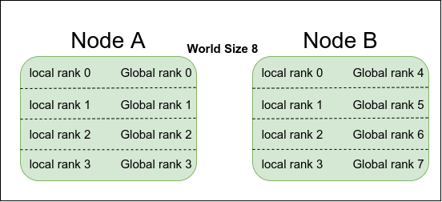

In this blog post, we will explore the concept of distributed training and delve into the details of PyTorch's DistributedDataParallel training approach.

## Some Prerequisite Definitions

1. **Process**:
A process is the basic unit of work in an operating system. In the usual context of DDP, you can put that one process control one GPU.

2. **Node**:
A node is a computational entity, you can think of that a node is a physical machine with several GPUs installed.

3. **WORLD_SIZE**:
The number of total available GPUs. It is the product of number of nodes and number of GPUs per node, it is a constant in a fixed configuration. For example, if there are two nodes and four GPUs per node, then the WORLD_SIZE is 8.

4. **RANK**:
It is an global id to identify a GPU among all the GPUs. For example, if we have two nodes with four GPUs each, the RANK will vary from 0−7.

5. **LOCAL_RANK**:
LOCAL_RANK is used to identify the local GPU in a specific node. For example, if we have two nodes with four GPUs each, LOCAL_RANK will vary from 0−3 for each node.



# How to configure DDP

To use DDP, you only need to configure your PyTorch training script in the following 3 steps:

1. Initialize: You need to initialize the distributed backend using `torch.distributed.init_process_group()`. This step ensures that all the devices can communicate with each other during the training process.
```python
rank = int(os.environ["RANK"])
world_size = int(os.environ['WORLD_SIZE'])
local_rank = int(os.environ['LOCAL_RANK'])
dist.init_process_group(backend="nccl", init_method="env://", world_size=world_size, rank=rank)
```
**Explanation**: Use `torchrun --nproc_per_node=4 ddp_train.py` to launch script, `torchrun` will configure the info into `os.environ` as environment variables, `world_size` and `rank` are also taken to initialize the backend. GPU training currently only achieves the best performance using the `nccl` distributed backend, thus `nccl` backend is the recommended backend to use for GPU training. The `init_method='env://'` is recommended since it simplifies the initialization of the process group by automatically detecting and utilizing the appropriate communication backend based on environment variables. 

2.  Wrap Model: Wrap your model with `torch.nn.parallel.DistributedDataParallel()` to enable parallel training, this is designed for distributed training and should be used when working with DDP.
```python
model = model.cuda(local_rank)
model = nn.SyncBatchNorm.convert_sync_batchnorm(model)
model = nn.parallel.DistributedDataParallel(model, device_ids=[local_rank])
```
**Explanation**: Regular batch normalization can introduce inconsistencies due to the differences in the statistics (mean and variance) calculated on each device. This can hinder the convergence of the model. By converting regular batch normalization layers to synchronized batch normalization layers using `nn.SyncBatchNorm.convert_sync_batchnorm()`, you can ensure consistent statistics calculation and improve the performance and convergence of your model.

3. Data Parallelism: Use `torch.utils.data.DistributedSampler()` to split the dataset across multiple devices.
```python
trainset = torchvision.datasets.CIFAR10(root='./data/cifar10', train=True, download=True, transform=train_transform)
train_sampler = torch.utils.data.distributed.DistributedSampler(dataset=trainset)
trainloader = torch.utils.data.DataLoader(trainset, batch_size=128, sampler=train_sampler, pin_memory=True)
```
And use `set_epoch(epoch)` in each epoch
```python
trainloader.sampler.set_epoch(epoch)
```

**Explanation**: `torch.utils.data.distributed.DistributedSampler()` provides distributed sampling of data across multiple devices, it shuffles the indices of the dataset before partitioning, thus do not specify `shuffle=True` in dataloader.

- **Note:** Do logging things on main worker, i.e., `local_rank==0`, otherwise the output will be a mess.

The complete codes are available at [github.](https://github.com/mstwutao/MiniDDP)

If you are running on Slurm based server, the example script to submit your job 

```bash
#!/bin/bash

#SBATCH --job-name=ddp
#SBATCH --partition=gpu
#SBATCH --nodes=2
#SBATCH --ntasks-per-node=2
#SBATCH --ntasks=4
#SBATCH --gres=gpu:2
#SBATCH --cpus-per-task=4
#SBATCH --mem-per-cpu=2G
#SBATCH --export=all
#SBATCH --output=%x.out
#SBATCH --time=48:00:00

srun --kill-on-bad-exit=1 python ddp.py
```