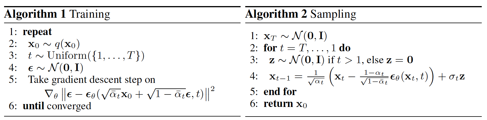

## Introduction

Diffusion models represent a cutting-edge advancement in the field of generative modeling， they offer a novel approach to learning complex data distributions by progressively corrupting training data with Gaussian noise and subsequently denoising it. By progressively corrupting the training data with Gaussian noise and then denoising it, diffusion models effectively learn to distinguish between signal and noise, thereby enhancing the model's ability to generate accurate and reliable samples. In computer vision, they hold the potential to revolutionize image generation and manipulation, enabling the creation of realistic and diverse visual content. As research in diffusion models continues to evolve, we anticipate further advancements in model architectures, training methodologies, and applications of diffusion models will shape the future of generative modeling and pave the way for innovative solutions to real-world challenges.

There are three generic diffusion modeling frameworks, which are based on **denoising diffusion probabilistic models**, **noise conditioned score networks**, and **stochastic differential equations**.

## Denoising Diffusion Probabilistic Models (DDPM)

#### Forward Diffusion Process 
Forward diffusion process gradually corrupt the training data using Gaussian noise. Let $p(x_0)$  be the data density, where the index 0 denotes the uncorrupted original data. Given a training sample $x_0 \sim p(x_0)$, the noised versions $x_1, x_2, ..., x_T$ are obtained following a Markovian process, $x_t=\sqrt{1-\beta_t} x_{t-1}+\sqrt{\beta_t} \epsilon_{t-1}$, where $\epsilon_{t-1} \sim \mathcal{N}(\mathbf{0}, \mathbf{I})$, the scaling factor $\sqrt{1-\beta_t}$ is needed to avoid making the variance "explode". We can also write the formula with a conditional probability distribution as:

$$
q\left(x_t \mid x_{t-1}\right)=\mathcal{N}\left(x_t ; \sqrt{1-\beta_t} x_{t-1}, \beta_t \mathbf{I}\right) 
$$

Where $T$ is the number of diffusion steps, $\beta_1, ..., \beta_T \in [0, 1)$ are hyperparameters representing the variance schedule across diffusion steps. An important property of this recursive formulation is that it also allows the direct sampling of $x_t$, when $t$ is drawn from a uniform distribution:

$$
q\left({x}_t \mid {x}_0\right)=\mathcal{N}\left({x}_t ; \sqrt{\bar{\alpha}_t} {x}_0,\left(1-\bar{\alpha}_t\right) \mathbf{I}\right)
$$

where $\alpha_t=1-\beta_t$ and $\bar{\alpha}_t=\alpha_1 \alpha_2 \ldots \alpha_t$. 

Essentially, we can sample any noisy version $x_t$ via a single step, if we have the original image $x_0$ and fix a variance schedule $\beta_t$.

$$ {x}_t=\sqrt{\bar{\alpha}_t} {x}_0+\sqrt{\left(1-\bar{\alpha}_t\right)} \epsilon $$

where $\epsilon \sim \mathcal{N}(\mathbf{0}, \mathbf{I})$

#### Backward Denoising Process 

Backward denoising process is a Markov chain with learned Gaussian transitions starting at $p\left({x}_T\right)=\mathcal{N}\left({x}_T ; \mathbf{0}, \mathbf{I}\right)$.

$$
p_\theta\left(x_{t-1} \mid x_t\right)=\mathcal{N}\left(x_{t-1} ; \mu_\theta\left(x_t, t\right), \Sigma_\theta\left(x_t, t\right)\right)
$$

#### Training DDPM

The training objective of DDPM is 


$$
\begin{aligned}
\log p_\theta(x) & \geq \mathbb{E}_{q\left(x_{1: T} \mid x_0\right)} \log \frac{p_\theta\left(x_{0: T}\right)}{q\left(x_{1: T} \mid x_0\right)} \\
& =\mathbb{E}_{q\left(x_{1: T} \mid x_0\right)}\left[\log \frac{p\left(x_T\right) \prod_{t=1}^T p_\theta\left(x_{t-1} \mid x_t\right)}{\prod_{t=1}^Tq\left(x_t \mid x_{t-1}\right)}\right] \\
&=\mathbb{E}_{q\left({x}_{1: T} \mid {x}_0\right)}\left[\log \frac{p\left({x}_T\right) p_{{\theta}}\left({x}_0 \mid {x}_1\right) \prod_{t=2}^T p_{{\theta}}\left({x}_{t-1} \mid {x}_t\right)}{q\left({x}_1 \mid {x}_0\right) \prod_{t=2}^T q\left({x}_t \mid {x}_{t-1}\right)}\right]\\
&=\mathbb{E}_{q\left({x}_{1: T} \mid {x}_0\right)}\left[\log \frac{p\left({x}_T\right) p_{{\theta}}\left({x}_0 \mid {x}_1\right) \prod_{t=2}^T p_{{\theta}}\left({x}_{t-1} \mid {x}_t\right)}{q\left({x}_1 \mid {x}_0\right) \prod_{t=2}^T q\left({x}_t \mid {x}_{t-1}, {x}_0\right)}\right]\\
&=\mathbb{E}_{q\left({x}_{1: T} \mid {x}_0\right)}\left[\log \frac{p_{{\theta}}\left({x}_T\right) p_{{\theta}}\left({x}_0 \mid {x}_1\right)}{q\left({x}_1 \mid {x}_0\right)}+\log \prod_{t=2}^T \frac{p_{{\theta}}\left({x}_{t-1} \mid {x}_t\right)}{q\left({x}_t \mid {x}_{t-1}, {x}_0\right)}\right]\\
&=\mathbb{E}_{q\left({x}_{1: T} \mid {x}_0\right)}\left[\log \frac{p\left({x}_T\right) p_{{\theta}}\left({x}_0 \mid {x}_1\right)}{q\left({x}_1 \mid {x}_0\right)}+\log \prod_{t=2}^T \frac{p_{{\theta}}\left({x}_{t-1} \mid {x}_t\right)}{\frac{q\left({x}_{t-1} \mid {x}_t, {x}_0\right) q\left({x}_t \mid {x}_0\right)}{q\left({x}_{t-1} \mid {x}_0\right)}}\right]\\
&=\mathbb{E}_{q\left({x}_{1: T} \mid {x}_0\right)}\left[\log \frac{p\left({x}_T\right) p_{{\theta}}\left({x}_0 \mid {x}_1\right)}{q\left({x}_T \mid {x}_0\right)}+\sum_{t=2}^T \log \frac{p_{{\theta}}\left({x}_{t-1} \mid {x}_t\right)}{q\left({x}_{t-1} \mid {x}_t, {x}_0\right)}\right]\\
&=\mathbb{E}_{q\left({x}_{1: T} \mid {x}_0\right)}\left[\log p_{{\theta}}\left({x}_0 \mid {x}_1\right)\right]+\mathbb{E}_{q\left({x}_{1: T} \mid {x}_0\right)}\left[\log \frac{p\left({x}_T\right)}{q\left({x}_T \mid {x}_0\right)}\right]+\sum_{t=2}^T \mathbb{E}_{q\left({x}_{1: T} \mid {x}_0\right)}\left[\log \frac{p_{{\theta}}\left({x}_{t-1} \mid {x}_t\right)}{q\left({x}_{t-1} \mid {x}_t, {x}_0\right)}\right]\\
&=\underbrace{\mathbb{E}_{q\left({x}_1 \mid {x}_0\right)}\left[\log p_{{\theta}}\left({x}_0 \mid {x}_1\right)\right]}_{\text {reconstruction term }}-\underbrace{D_{\mathrm{KL}}\left(q\left({x}_T \mid {x}_0\right) \| p\left({x}_T\right)\right)}_{\text {prior matching term }}-\sum_{t=2}^T \underbrace{\mathbb{E}_{q\left({x}_t \mid {x}_0\right)}\left[D_{\mathrm{KL}}\left(q\left({x}_{t-1} \mid {x}_t, {x}_0\right) \| p_{{\theta}}\left({x}_{t-1} \mid {x}_t\right)\right)\right]}_{\text {denoising matching term }}
\end{aligned}
$$


Since prior matching term is a constant, all remaining is to minimize the denoising matching term $\sum_{t=2}^T E_{q\left(x_t \mid x_0\right)}\left[D_{K L}\left(q\left(x_{t-1} \mid x_t, x_0\right)|| p_\theta\left(x_{t-1} \mid x_t\right)\right]\right.$


$$
\begin{aligned}
q\left(x_{t-1} \mid x_t, x_0\right) & =\frac{q\left(x_{t-1}, x_t, x_0\right)}{q\left(x_t, x_0\right)} \\
& =\frac{q\left(x_t \mid x_{t-1}\right) q\left(x_{t-1} \mid x_0\right) q\left(x_0\right)}{q\left(x_t \mid x_0\right) q\left(x_0\right)} \\
& =\frac{q\left(x_t \mid x_{t-1}\right) q\left(x_{t-1} \mid x_0\right)}{q\left(x_t \mid x_0\right)}
\end{aligned}
$$


We have 


$$
\begin{aligned}
q\left(x_t \mid x_{t-1}\right) &=  N\left(\sqrt{\alpha_t} x_{t-1},\left(1-\alpha_t\right) \mathbf{I}\right) \\
q\left(x_{t-1} \mid x_0\right) &=  N\left(\sqrt{\bar{\alpha}_{t-1}} x_0,\left(1-\bar{\alpha}_{t-1}\right) \mathbf{I}\right) \\
q\left(x_t \mid x_0\right)  &=  N\left(\sqrt{\bar{\alpha}_t} x_0,\left(1-\bar{\alpha}_t\right) \mathbf{I}\right)
\end{aligned}
$$


so $q\left(x_{t-1} \mid x_t, x_0\right)$ is also a Gussian and the denoising matching term is the KL divergence between two Guassians which can be calculated with closed form expressions instead of high variance Monte Carlo estimates.

we obtain


$$
\begin{aligned}
q\left({x}_{t-1} \mid {x}_t, {x}_0\right) & =\frac{q\left({x}_t \mid {x}_{t-1}, {x}_0\right) q\left({x}_{t-1} \mid {x}_0\right)}{q\left({x}_t \mid {x}_0\right)} \\
& =\frac{\mathcal{N}\left({x}_t ; \sqrt{\alpha_t} {x}_{t-1},\left(1-\alpha_t\right) \mathbf{I}\right) \mathcal{N}\left({x}_{t-1} ; \sqrt{\alpha_{t-1}} {x}_0,\left(1-\bar{\alpha}_{t-1}\right) \mathbf{I}\right)}{\mathcal{N}\left({x}_t ; \sqrt{\bar{\alpha}_t} {x}_0,\left(1-\bar{\alpha}_t\right) \mathbf{I}\right)}\\
&\propto \exp \left\{-\left[\frac{\left({x}_t-\sqrt{\alpha_t} {x}_{t-1}\right)^2}{2\left(1-\alpha_t\right)}+\frac{\left({x}_{t-1}-\sqrt{\bar{\alpha}_{t-1}} {x}_0\right)^2}{2\left(1-\bar{\alpha}_{t-1}\right)}-\frac{\left({x}_t-\sqrt{\bar{\alpha}_t} {x}_0\right)^2}{2\left(1-\bar{\alpha}_t\right)}\right]\right\}\\
&=\exp \left\{-\frac{1}{2}\left(\frac{1}{\frac{\left(1-\alpha_t\right)\left(1-\bar{\alpha}_{t-1}\right)}{1-\bar{\alpha}_t}}\right)\left[{x}_{t-1}^2-2 \frac{\sqrt{\alpha_t}\left(1-\bar{\alpha}_{t-1}\right) {x}_t+\sqrt{\bar{\alpha}_{t-1}}\left(1-\alpha_t\right) {x}_0}{1-\bar{\alpha}_t} {x}_{t-1}\right]\right\}\\
&\propto \mathcal{N}({x}_{t-1} ; \frac{\sqrt{\alpha_t}\left(1-\bar{\alpha}_{t-1}\right) {x}_t+\sqrt{\bar{\alpha}_{t-1}}\left(1-\alpha_t\right) {x}_0}{1-\bar{\alpha}_t}, \left.\frac{\left(1-\alpha_t\right)\left(1-\bar{\alpha}_{t-1}\right)}{1-\bar{\alpha}_t} \mathbf{I}\right)\\
&=\mathcal{N}({x}_{t-1} ; \underbrace{\frac{1}{\sqrt{\alpha_t}}\left(x_t-\frac{1-\alpha_t}{\sqrt{1-\bar{\alpha}_t}} \epsilon\right)}_{\mu_q\left({x}_t\right)}, \underbrace{\left.\frac{\left(1-\alpha_t\right)\left(1-\bar{\alpha}_{t-1}\right)}{1-\bar{\alpha}_t} \mathbf{I}\right)}_{{\Sigma}_q(t)}

\end{aligned}
$$


Since ${\Sigma}_q(t)$ does not depend on the model parameters, so the objective of backward denoising process is to estimate the $\mu_q\left({x}_t\right)$, i.e., ${\mu}_\theta$ must predict $\frac{1}{\sqrt{\alpha_t}}\left({x}_t-\frac{\beta_t}{\sqrt{1-\bar{\alpha}_t}} {\epsilon}\right)$ given ${x}_t$, to make it simple, we make the model estimate $\epsilon$ for any time step, so the denoising matching term simplify to


$$
\mathbb{E}_{t \sim[1, T]} \mathbb{E}_{x_0 \sim p\left(x_0\right)} \mathbb{E}_{\epsilon_t \sim \mathcal{N}(0, \mathbf{I})}\left\|\epsilon_t-\epsilon_\theta\left(\sqrt{\bar{\alpha}_t} \mathbf{x}_0+\sqrt{1-\bar{\alpha}_t} \epsilon_t, t\right)\right\|^2
$$


after the model is trained, then we can perform backward denoising process with $p_\theta\left(x_{t-1} \mid x_t\right)=\mathcal{N}\left(x_{t-1} ; \mu_\theta\left(x_t, t\right), \Sigma_\theta\left(x_t, t\right)\right)$, i.e., 


$$
{x}_{t-1}=\frac{1}{\sqrt{\alpha_t}}\left({x}_t-\frac{\beta_t}{\sqrt{1-\bar{\alpha}_t}} {\epsilon}_\theta\left({x}_t, t\right)\right)+\sigma_t {z}, \text { where } {z} \sim \mathcal{N}(\mathbf{0}, \mathbf{I})
$$


## Noise Conditioned Score Networks (NCSN)

Let's consider Energy-Based Models (EBMs) whose density expressed is given by:


$$
p_{{\theta}}({x})=\frac{\exp \left(-E_{{\theta}}({x})\right)}{Z_{{\theta}}}
$$


where $E_\theta(\mathrm{x})$ (the energy) is a nonlinear function with parameters $\theta$, and $Z_\theta$ denotes the normalizing constant (the partition function): $Z_{{\theta}}=\int \exp \left(-E_{{\theta}}({x})\right) \mathrm{d} {x}$ which is constant w.r.t ${x}$ but is a function of ${\theta}$. Since $Z_{{\theta}}$ is a function of ${\theta}$, evaluation and differentiation of $\log p_{{\theta}}({x})$ w.r.t. its parameters involves a typically intractable integral.

Although we cannot directly compute the likelihood of an EBM as in the maximum likelihood approach due to the intractable normalizing constant $Z_{\theta}$, we can estimate the gradient of the log-likelihood with MCMC approaches, allowing for likelihood maximization with gradient ascent. The gradient of the log-probability of an EBM decomposes as a sum of two terms: 


$$
\nabla_{{\theta}} \log p_{{\theta}}({x})=-\nabla_{{\theta}} E_{{\theta}}({x})-\nabla_{{\theta}} \log Z_{{\theta}}
$$


The first gradient term, $-\nabla_\theta E_\theta({x})$, is straightforward to evaluate with backpropagation. the second gradient term, $\nabla_{{\theta}} \log Z_{{\theta}}$, which is intractable to compute exactly, thus we can estimate it as:


$$
\begin{aligned}
\nabla_{{\theta}} \log Z_{{\theta}} &=\nabla_{{\theta}} \log \int \exp \left(-E_{{\theta}}({x})\right) d {x} \\
& = \int p_{{\theta}}({x})\left(-\nabla_{{\theta}} E_{{\theta}}({x})\right) d {x} \\
& =\mathbb{E}_{{x} \sim p_{{\theta}}({x})}\left[-\nabla_{{\theta}} E_{{\theta}}({x})\right]
\end{aligned}
$$


Thus, we can obtain an unbiased Monte Carlo estimate of the log-likelihood gradient and optimize the parameters with stochastic gradient ascent as long as we can draw random samples from the model. Drawing random samples is far from being trivial, much of the literature has focused on methods for efficient MCMC sampling from EBMs, but running MCMC till convergence to obtain a sample ${x} \sim p_{{\theta}}({x})$ can be computationally expensive.

Here we make use of the fact that the gradient of the log-probability w.r.t. x (a.k.a., score) is equal to the negative gradient of the energy:


$$
\nabla_{{x}} \log p_{{\theta}}({x})=-\nabla_{{x}} E_{{\theta}}({x})-\underbrace{\nabla_{{x}} \log Z_{{\theta}}}_{=0}=-\nabla_{{x}} E_{{\theta}}({x})
$$


We can learn an EBM by (approximately) matching the first derivatives of its log-PDF to the first derivatives of the log-PDF of the data distribution. If they match, then the EBM captures the data distribution exactly.The basic Score Matching (SM) objective minimizes a discrepancy between two distributions called the Fisher divergence:


$$
D_F\left(p_{\text {data }}({x}) \| p_{{\theta}}({x})\right)=\mathbb{E}_{p_{\text {data }}({x})}\left[\frac{1}{2}\left\|\nabla_{{x}} \log p_{\text {data }}({x})-\nabla_{{x}} \log p_{{\theta}}({x})\right\|^2\right]
$$


However, $\nabla_{{x}} \log p_{{\theta}}({x})$ is still unknown. Using integration by parts, the above can be rewritten as:


$$
D_F\left(p_{\text {data }}({x}) \| p_{{\theta}}({x})\right)=\mathbb{E}_{p_{\text {data }}({x})}\left[\frac{1}{2} \sum_{i=1}^d\left(\frac{\partial E_{{\theta}}({x})}{\partial x_i}\right)^2+\frac{\partial^2 E_{{\theta}}({x})}{\left(\partial x_i\right)^2}\right]+\text { constant }
$$


where $d$ is the dimensionality of ${x}$. A downside of the above objective is the computation of full second derivatives is quadratic in the dimensionality $d$, thus does not scale to high dimensionality. To alleviate this difficulty, Denoising Score Matching (DSM) and Sliced Score Matching (SSM) are proposed as computationally efficient solutions.

## Stochastic Differential Equations (SDE)

## Reference

1. [Croitoru, Florinel-Alin, et al. "Diffusion models in vision: A survey." IEEE Transactions on Pattern Analysis and Machine Intelligence (2023).](https://arxiv.org/pdf/2209.04747.pdf)

